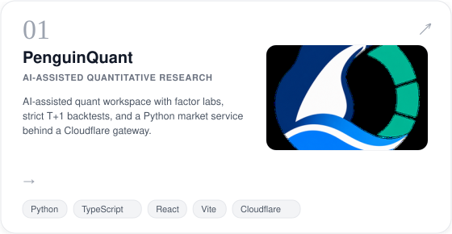
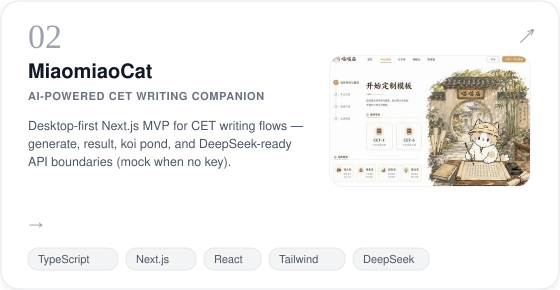
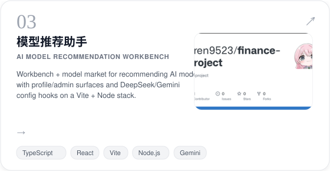
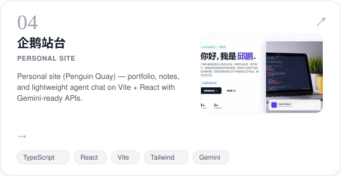
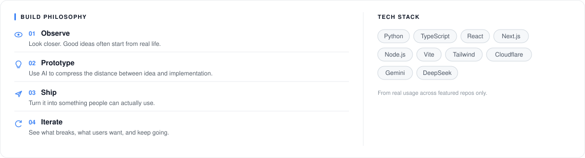

<!--
  GitHub Profile README — Eren9523 / Penguin Workshop
  Side-by-side hero: clickable text LEFT, photo RIGHT (GitHub-safe table).
-->

<table width="100%">
  <tr>
    <td width="65%" valign="middle">
      
SMALL IDEAS, CAREFULLY BUILT.

      
      <h2>Penguin <a href="https://github.com/Eren9523">Workshop</a></h2>
      
<em>small ideas, carefully built.</em>

      
Hi, I'm <strong>Qiu Peng</strong> (<a href="https://github.com/Eren9523">Eren9523</a>) — an AI-native product builder who loves turning ideas into real products.

      
I build at the intersection of AI, products, web, data and automation, and I'm always curious about what's next.

      

        <code>📍 Wuhan, China</code>
        <code>♥ Build</code>
        <code>▣ Learn</code>
        <code>🚀 Iterate</code>
        <code>∞ AI-native</code>
      

    </td>
    <td width="35%" valign="middle" align="center">
      
    </td>
  </tr>
</table>

 

---

<table>
  <tr>
    <td>
      
<strong>FEATURED PROJECTS</strong>

    </td>
    <td align="right">
      
SOME IDEAS, TURNED INTO REAL THINGS.

    </td>
  </tr>
</table>

 

  

 

<strong>CONTRIBUTIONS</strong>

  

 

<table width="100%">
  <tr>
    <td>
      
<em>Building a more open, useful, and human internet.</em>

    </td>
    <td align="right">
      
Find more on <a href="https://github.com/Eren9523">github.com/Eren9523</a> →

    </td>
  </tr>
</table>
