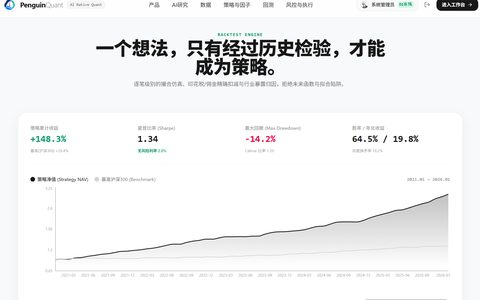
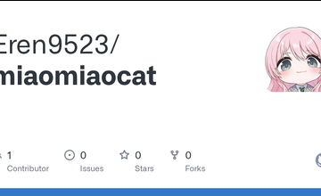
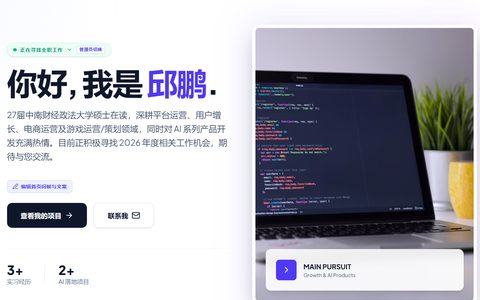
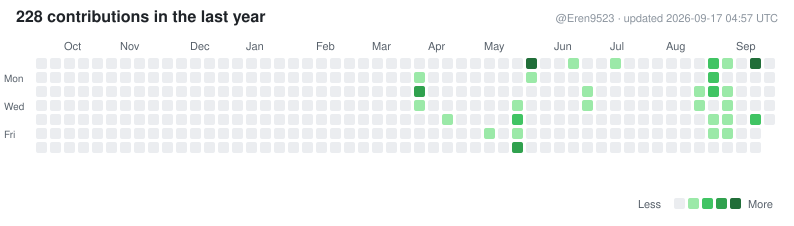

<!--
  GitHub Profile README — Eren9523 / Penguin Workshop
  Side-by-side hero: clickable text LEFT, photo RIGHT (GitHub-safe table).
-->

<table width="100%">
  <tr>
    <td width="65%" valign="middle">
      
SMALL IDEAS, CAREFULLY BUILT.

      
      <h2>Penguin <a href="https://github.com/Eren9523">Workshop</a></h2>
      
<em>small ideas, carefully built.</em>

      
Hi, I'm <strong>Qiu Peng</strong> (<a href="https://github.com/Eren9523">Eren9523</a>) — an AI-native product builder who loves turning ideas into real products.

      
I build at the intersection of AI, products, web, data and automation, and I'm always curious about what's next.

      

        <code>📍 Wuhan, China</code>
        <code>♥ Build</code>
        <code>▣ Learn</code>
        <code>🚀 Iterate</code>
        <code>∞ AI-native</code>
      

    </td>
    <td width="35%" valign="middle" align="center">
      
    </td>
  </tr>
</table>

 

---

<table>
  <tr>
    <td>
      
<strong>FEATURED PROJECTS</strong>

    </td>
    <td align="right">
      
SOME IDEAS, TURNED INTO REAL THINGS.

    </td>
  </tr>
</table>

<table width="100%">
  <tr>
    <td width="50%" valign="top">
      <h3><a href="https://github.com/Eren9523/PenguinQuant">PenguinQuant</a></h3>
      
AI-assisted quantitative research — backtesting, strategy exploration, and AI-native quant workflows.

      

        <code>Python</code>
        <code>AI</code>
        <code>Quant</code>
        <code>Backtest</code>
      

      
    </td>
    <td width="50%" valign="top">
      <h3><a href="https://github.com/Eren9523/miaomiaocat">MiaomiaoCat</a></h3>
      
AI-powered CET writing companion — practice essays, get feedback, and improve with guided prompts.

      

        <code>TypeScript</code>
        <code>React</code>
        <code>AI</code>
        <code>Education</code>
      

      
    </td>
  </tr>
  <tr>
    <td width="50%" valign="top">
      <h3><a href="https://github.com/Eren9523/finance-project">模型推荐助手</a></h3>
      
AI model recommendation workbench — compare models and pick the right one for the job.

      

        <code>Python</code>
        <code>AI</code>
        <code>Recommendation</code>
        <code>Workbench</code>
      

      
    </td>
    <td width="50%" valign="top">
      <h3><a href="https://github.com/Eren9523/my-introduce-of-web">企鹅站台</a></h3>
      
Personal site — a small station for ideas, projects, and the Penguin Workshop story.

      

        <code>Web</code>
        <code>Frontend</code>
        <code>Portfolio</code>
      

      
    </td>
  </tr>
</table>

 

<table width="100%">
  <tr>
    <td width="66%" valign="top">
      
<strong>BUILD PHILOSOPHY</strong>

      <table width="100%">
        <tr>
          <td width="50%" valign="top">
            
<strong>01 · Observe</strong>

            
Look closer. Good ideas often start from real life.

          </td>
          <td width="50%" valign="top">
            
<strong>02 · Prototype</strong>

            
Use AI to compress the distance between idea and implementation.

          </td>
        </tr>
        <tr>
          <td width="50%" valign="top">
            
<strong>03 · Ship</strong>

            
Turn it into something people can actually use.

          </td>
          <td width="50%" valign="top">
            
<strong>04 · Iterate</strong>

            
See what breaks, what users want, and keep going.

          </td>
        </tr>
      </table>
    </td>
    <td width="4%"></td>
    <td width="30%" valign="top">
      
<strong>TECH STACK</strong>

      
<code>Python</code> <code>TypeScript</code>

      
<code>React</code> <code>Next.js</code>

      
<code>Node.js</code> <code>Vite</code>

      
<code>Tailwind</code> <code>Cloudflare</code>

      
<code>Gemini</code> <code>DeepSeek</code>

      
From real usage across featured repos only.

    </td>
  </tr>
</table>

 

<strong>CONTRIBUTIONS</strong>

  

 

<table width="100%">
  <tr>
    <td>
      
<em>Building a more open, useful, and human internet.</em>

    </td>
    <td align="right">
      
Find more on <a href="https://github.com/Eren9523">github.com/Eren9523</a> →

    </td>
  </tr>
</table>
